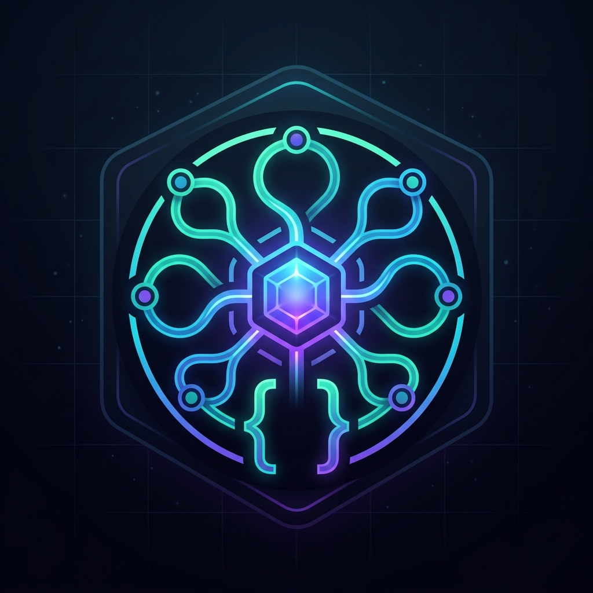

# Claude Code Model Selector (OmniRoute) 🔀

An unofficial, powerful VS Code extension that integrates directly with **OmniRoute** to bring 300+ AI models straight into Claude Code via your VS Code status bar. 

No more manually editing `.claude/settings.json` — switch models with a single click and let OmniRoute handle the complex routing, API keys, and failovers.



## Features 🌟

- **Live Model Fetching**: Dynamically reads all available models from your local OmniRoute instance (`http://localhost:20128`).
- **Smart OmniRoute Combos (`auto/*`)**: First-class support for OmniRoute's `auto/*` routing models. Just pick `auto/best-coding` or `auto/pro-coding`, and let the gateway pick the best, cheapest, or fastest provider automatically.
- **Background Health Probing**: Automatically pings models in the background when you open the picker. Instantly see if a model is ✅ Working, ❌ Broken, or ⏳ Slow *before* you select it.
- **Pricing Tags**: Models are auto-tagged as 🟢 FREE, 🟡 CHEAP, or 🔴 PAID so you always know what you're consuming.
- **Provider Categorization**: Models are grouped elegantly by provider (Antigravity, Auggie, AgentRouter, Kiro, DuckDuckGo, etc.) for easy navigation.
- **Non-Destructive**: Safely merges your selections into your `.claude/settings.local.json` file, preserving all your other environment variables (like your `ANTHROPIC_API_KEY`).

## Requirements 📋

1. You must be running [OmniRoute](https://github.com/omniroute/omniroute) locally. By default, it runs on port `20128`.
2. You need an active API key from your OmniRoute Dashboard.

## Quick Start 🚀

1. **Install OmniRoute**: `npm install -g omniroute`
2. **Start OmniRoute**: Run `omniroute` in your terminal.
3. **Configure Claude Code**: Ensure your `.claude/settings.local.json` is pointed to the local OmniRoute instance:
   ```json
   {
     "env": {
       "ANTHROPIC_BASE_URL": "http://localhost:20128",
       "ANTHROPIC_API_KEY": "<your-omniroute-dashboard-key>",
       "CLAUDE_CODE_ENABLE_GATEWAY_MODEL_DISCOVERY": "1"
     }
   }
   ```
4. **Use the Picker**: Click the 🤖 robot icon in your VS Code status bar (bottom right), or run the command **"Claude: Select Profile"**.

## Smart Routing Models (`auto/*`)

OmniRoute features an advanced "Combo Engine". We highly recommend using these in the **Auto** section of the picker:

- `auto/best-coding` - OmniRoute routes to the absolute best coding model currently available.
- `auto/pro-coding` - Professional grade coding with automatic fallback.
- `auto/coding:free` - Connects you to the best **free tier** coding model available.
- `auto/claude-opus` - Routes you to the best provider for Claude Opus.

If a provider goes down or you run out of quota, OmniRoute's 4-tier fallback kicks in instantly without breaking your Claude Code session.

## Commands ⌨️

- `Claude: Select Profile` - Opens the main model picker.
- `Claude: Refresh Model List` - Bypasses the 5-minute cache and forces a fresh list from OmniRoute.
- `Claude: Show Current Model` - Displays what you're currently using in the status bar.

---

*Note: This extension is for use with OmniRoute and Claude Code. It is not affiliated with Anthropic.*
